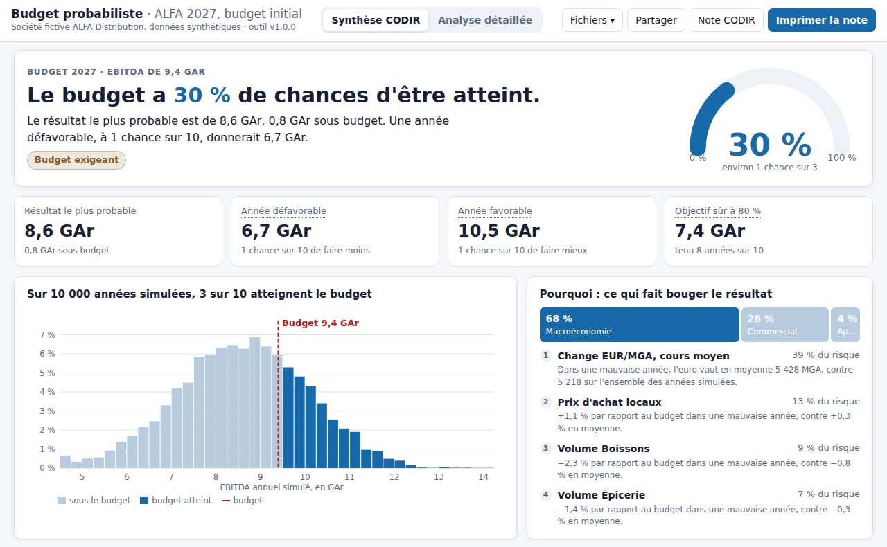
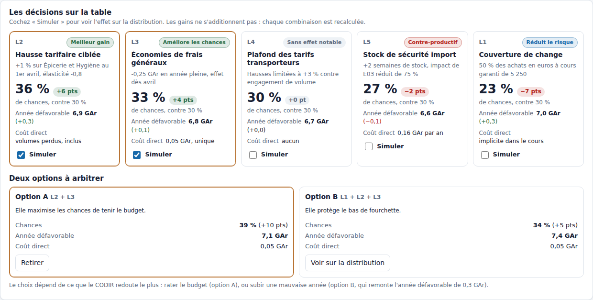
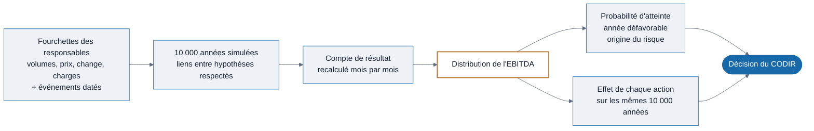
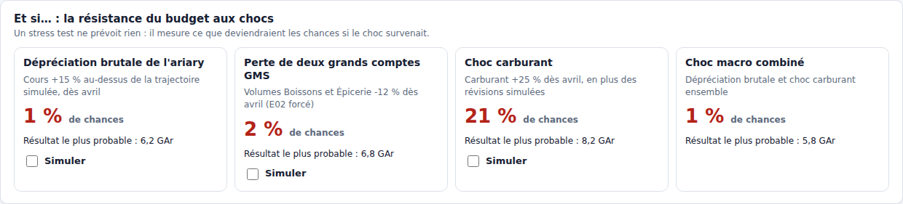
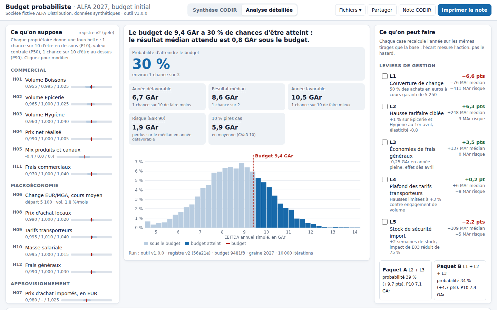
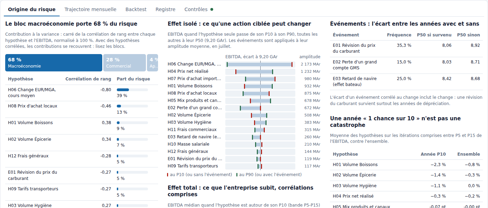
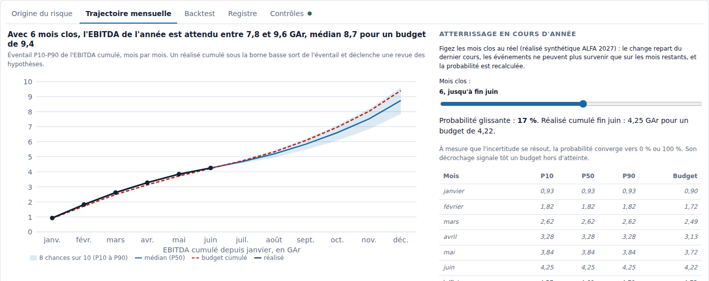
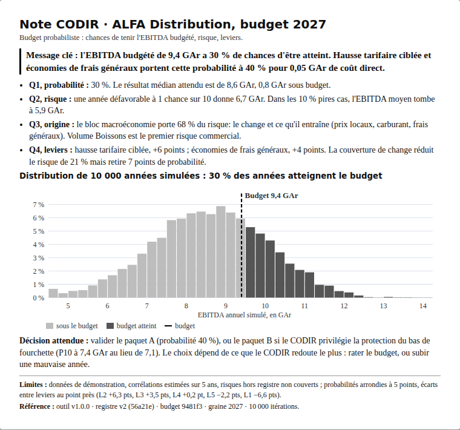
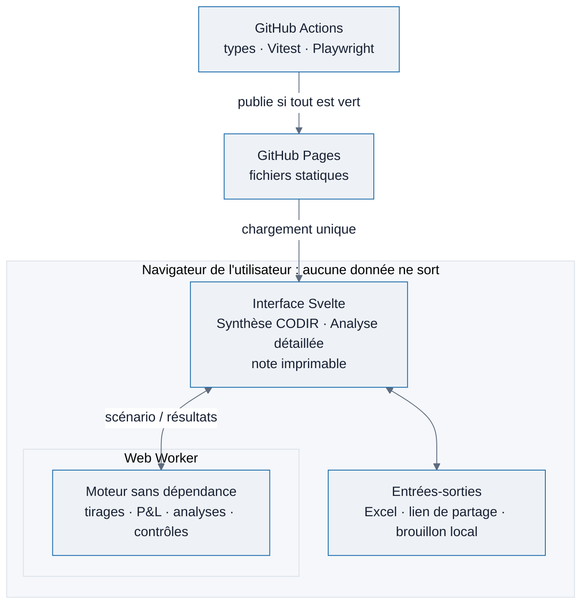
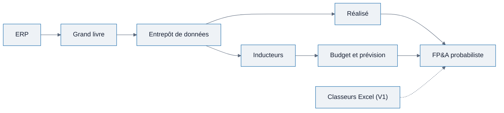

# Budget probabiliste

**Quelle chance avez-vous de tenir votre budget, et que faire pour l'améliorer ?**

FP&A probabiliste : budget, atterrissage, risque, backtest et arbitrages, sur une même distribution de résultats.

[](https://mirindras.github.io/budget-probabiliste/)

[](https://github.com/mirindras/budget-probabiliste/actions/workflows/ci.yml)


Outil web pour directions financières : il mesure la probabilité d'atteindre l'EBITDA budgété, ce qu'une mauvaise année coûterait, d'où vient le risque et quelles actions le réduisent.

Rien à installer, aucun compte, aucune donnée envoyée : le calcul se fait dans le navigateur. La démonstration porte sur ALFA Distribution, un distributeur fictif à Madagascar ; toutes ses données sont synthétiques.



## Le problème

Un budget annuel fixe un chiffre : « l'EBITDA sera de 9,4 milliards d'ariarys ». Il ne dit pas si ce chiffre est prudent, réaliste ou presque impossible à tenir.

Les scénarios « bas » et « haut » habituels n'aident guère. Ils appliquent ±10 % à toutes les hypothèses à la fois, comme si tout dérapait ensemble, ce qui n'arrive presque jamais. Et ils ignorent les hypothèses qui bougent vraiment ensemble : quand l'ariary se déprécie, les achats importés, le carburant et les frais généraux augmentent en même temps.

Résultat : le CODIR vote un budget sans savoir quelle est sa marge d'erreur, ni sur quoi agir en priorité.

## Les quatre questions auxquelles l'outil répond

| Question du CODIR | Réponse sur l'exemple ALFA 2027 |
| --- | --- |
| Quelle chance avons-nous d'atteindre l'EBITDA budgété ? | **30 %**, soit environ 1 chance sur 3 ; le résultat médian est de 8,6 GAr, 0,8 GAr sous le budget |
| Combien perd-on dans une année défavorable, à 1 chance sur 10 ? | l'EBITDA tombe à **6,7 GAr**, soit 1,9 GAr de moins que le résultat médian |
| D'où vient le risque ? | à **68 %** de l'environnement macroéconomique : le taux de change et ce qu'il entraîne (prix locaux, carburant, frais généraux). Part de la variance de l'EBITDA simulé, sur les données synthétiques ALFA : un résultat du modèle, pas une observation sur une entreprise réelle |
| Quelles actions améliorent les chances, et à quel coût ? | une hausse tarifaire ciblée et des économies de frais généraux portent la probabilité à **40 %**, pour 0,05 GAr de coût direct |

## La décision qu'il éclaire

L'outil ne remplace pas le budget : le budget reste l'objectif. Il mesure son exigence et met des options chiffrées devant le CODIR. Sur l'exemple ALFA, l'arbitrage se présente ainsi :

- **Option A** (hausse tarifaire et économies de frais généraux) : elle maximise les chances de tenir le budget, qui passent de 30 % à 40 %.
- **Option B** (option A plus une couverture de change) : les chances ne montent qu'à 34 %, mais l'année défavorable remonte de 7,1 à 7,4 GAr.

Le choix dépend de ce que le CODIR redoute le plus : rater le budget, ou subir une mauvaise année. L'outil ne tranche pas ; il rend l'arbitrage explicite.



## Vocabulaire

Chaque terme a un seul sens, dans l'outil comme dans ce document. Les chiffres viennent de 10 000 années simulées.

| Terme | Définition | Notation |
| --- | --- | --- |
| Probabilité d'atteinte | part des années simulées où l'EBITDA atteint au moins le budget | |
| Résultat médian | autant de chances de faire moins que de faire mieux ; ce n'est pas le « plus probable » au sens du mode | P50 |
| Année défavorable | 1 chance sur 10 de faire moins | P10 |
| Année favorable | 1 chance sur 10 de faire mieux | P90 |
| Objectif à 80 % de chances | niveau atteint ou dépassé dans 8 années simulées sur 10 | P20 |
| Risque | perte d'une année défavorable par rapport au résultat médian | EaR 90 = P50 − P10 |
| 10 % pires cas | moyenne de l'EBITDA sur les 10 % d'années les plus basses | CVaR 10 |
| Part du risque | part de la variance de l'EBITDA simulé portée par une hypothèse ou un bloc (corrélation de rang au carré, normalisée à 100 %) ; un résultat du modèle, pas une mesure du risque réel | |

## Comment ça fonctionne



1. **Chaque responsable donne une fourchette, pas un chiffre.** Le directeur commercial estime ses volumes, les achats leurs prix, la trésorerie le taux de change : une valeur basse, une valeur centrale, une valeur haute, et une justification écrite.
2. **L'outil simule 10 000 années possibles.** Dans chacune, chaque hypothèse prend une valeur dans sa fourchette, en respectant les liens entre elles (un ariary faible renchérit à la fois les achats importés et le carburant) et des événements datés (perte d'un grand client, retard de navire, révision du prix du carburant).
3. **Il recalcule le compte de résultat de chaque année**, mois par mois, jusqu'à l'EBITDA, avec les mêmes règles que le budget. Toutes les hypothèses à leur valeur budgétée, il retrouve exactement l'EBITDA budgété.
4. **Il compte.** Si 3 000 années sur 10 000 atteignent le budget, la probabilité est de 30 %. La même distribution donne l'année défavorable, l'origine du risque et l'effet de chaque action.

Chaque action est testée sur exactement les mêmes 10 000 années que le budget de départ : l'écart mesure l'effet de l'action, pas le hasard du tirage.

## Ce que l'utilisateur voit

**Synthèse CODIR**, la vue par défaut, pour le CFO et le CODIR :

- la réponse en une phrase et une jauge (« Le budget a 30 % de chances d'être atteint ») ;
- quatre chiffres clés en GAr : résultat médian, année défavorable, année favorable, objectif à 80 % de chances ;
- le pourquoi : la part du risque par famille, et les hypothèses qui pèsent le plus, expliquées en clair ;
- les décisions sur la table : chaque action avec son effet sur les chances, sur l'année défavorable et son coût, puis les options A et B à arbitrer ;
- les « et si » : ce que deviendraient les chances après une dépréciation brutale de l'ariary, la perte de deux grands comptes ou un choc carburant.



**Analyse détaillée**, pour le contrôle de gestion et le FP&A : hypothèses modifiables en curseurs, leviers et stress tests, origine du risque, trajectoire mensuelle et atterrissage en cours d'année, backtest sur les budgets passés, registre des hypothèses, contrôles.



| Origine du risque | Atterrissage en cours d'année |
| --- | --- |
|  |  |
| Part du risque par hypothèse, effet d'une action ciblée, écart entre les années avec et sans chaque événement. | Les mois clos sont figés au réel ; la probabilité est recalculée à chaque clôture. |

**Pour restituer et partager** : une note CODIR d'une page A4 à imprimer, un lien qui rejoue exactement le même scénario, des exports Excel prêts pour Power BI. Pour essayer avec ses propres chiffres : télécharger le modèle Excel, le remplir, le déposer dans la page ; rien ne quitte le poste.

<p align="center"></p>

Guide d'une page : [docs/guide-utilisateur.md](docs/guide-utilisateur.md). Formats d'import et d'export : [docs/dictionnaire-donnees.md](docs/dictionnaire-donnees.md).

## Ce que le modèle a appris sur l'exemple

- **Le budget n'est pas pessimiste à 30 % par hasard.** Il additionne des valeurs centrales légèrement optimistes (volumes Boissons au-dessus de l'avis de leur responsable, change budgété sous le cours attendu) et ignore les chocs datés, qui frappent au moins une fois dans 58 % des années.
- **Une année défavorable n'est pas une catastrophe.** C'est un ariary un peu plus faible, des volumes un peu plus bas et une révision du carburant : un scénario plausible, donc utile pour préparer des parades.
- **Le change est le risque à piloter en priorité.** L'entreprise encaisse un choc carburant de +25 % (les chances passent de 30 % à 21 %), mais pas une dépréciation brutale de l'ariary (les chances tombent à 1 %).
- **Réduire le risque n'augmente pas toujours les chances.** La couverture de change resserre la distribution, ce qui protège l'année défavorable mais éloigne aussi les bonnes années, puisque le résultat médian est sous le budget.
- **Les fourchettes des responsables sont trop étroites.** Rejouées sur 2024 à 2026, elles n'ont couvert que 60 % des réalisés au lieu des 80 % visés. L'outil propose de les élargir d'un facteur 1,5.

## Profondeur technique

Pour les lecteurs Data, Software ou Quant, voici ce qui garantit des chiffres justes et reproductibles.

- **Simulation Monte Carlo en hypercube latin** (LHS) : chaque loi est couverte uniformément ; sur le protocole de validation ALFA, 10 000 tirages donnent une précision empirique d'environ ±0,6 point sur la probabilité d'atteinte (intervalle à 95 %).
- **Lois choisies par règle** à partir des fourchettes P10 / P50 / P90 : normale, split-normale pour les risques asymétriques, lognormale pour les prix, PERT pour les grandeurs bornées.
- **Dépendances** : corrélations de rang (Spearman) converties pour une copule gaussienne, décomposition de Cholesky, correction de Higham si la matrice saisie est incohérente.
- **Dynamiques mensuelles** : marche aléatoire du change conditionnée au choc annuel, bruit AR(1) des volumes recentré sur la saisonnalité, événements Bernoulli datés.
- **Aléa commun** : leviers et stress tests réutilisent les tirages de la base ; un levier sans effet donne un écart exactement nul.
- **Attribution du risque** : contribution à la variance par corrélation de rang, effet isolé contre effet total, profil moyen des années P5 à P15.
- **Calibration** : backtest par hypothèse et par trimestre (couverture, PIT, score de Brier, CRPS), coefficient d'élargissement k = Φ⁻¹(0,9) / Φ⁻¹((1 + c) / 2).
- **Reproductibilité** : générateur à graine xoshiro128** en arithmétique entière, identique bit à bit pour une même graine ; chaque résultat porte sa référence de run.
- **Vérité connue** : un jeu synthétique généré par un processus dont on connaît les vrais paramètres permet de vérifier que le moteur est calibré.

## Architecture

Une page web statique en TypeScript (Vite, Svelte 5). Le moteur n'a aucune dépendance et tourne dans un Web Worker, avec un repli automatique sur le fil principal si l'environnement interdit les workers : l'écran reste fluide pendant le calcul. Une simulation complète prend moins d'une demi-seconde.



```
index.html
src/
  engine/              moteur sans dépendance
    rng.ts             générateur à graine xoshiro128** (M4)
    stats.ts           loi normale, percentiles, rangs, khi-deux, bêta
    laws.ts            lois et fonctions quantiles, choix de la loi 5.3 (M2)
    copula.ts          corrélations de rang, copule, Cholesky, correction de Higham (M3)
    dynamics.ts        bruit AR(1) recentré, marche aléatoire du change (M3)
    sampling.ts        hypercube latin, tirages corrélés, événements (M4)
    pl.ts              moteur P&L mensuel (M5)
    risk.ts            indicateurs, attribution, profils, éventail (M6)
    levers.ts          leviers et stress tests à aléa commun (M7)
    backtest.ts        backtest, calibration, vérité connue (M8)
    synthetic.ts       générateur du jeu synthétique (section 16)
    controls.ts        contrôles C01 à C12 (M9)
    simulate.ts        orchestration d'un run, référence de run
    alfa.ts, types.ts  jeu ALFA préchargé, modèle de données
  engine-host.ts       traitement des requêtes, partagé par le worker et le repli
  worker.ts            calcul en tâche de fond
  io/                  excel.ts (SheetJS), share.ts (lz-string), storage.ts (IndexedDB)
  ui/                  vues Synthèse CODIR et Analyse détaillée, graphiques SVG, note imprimable (M10)
data/alfa/             budget.json, registre.json : ALFA préchargée
templates/             BUDGET_BASE.xlsx, REGISTRE_HYPOTHESES.xlsx
tests/                 engine et io (Vitest), e2e (Playwright)
reference/             prototype Python et valeurs attendues (annexe F)
docs/                  SFD, guide utilisateur, dictionnaire des données, design
```

Correspondance avec les modules de la SFD : M1 Données (`io/excel.ts`, `engine/alfa.ts`), M2 Registre (`engine/laws.ts`), M3 Dépendances (`engine/copula.ts`, `engine/dynamics.ts`), M4 Simulation (`engine/sampling.ts`, `engine/rng.ts`), M5 Moteur P&L (`engine/pl.ts`), M6 Analyses (`engine/risk.ts`), M7 Leviers (`engine/levers.ts`), M8 Backtest (`engine/backtest.ts`, `engine/synthetic.ts`), M9 Contrôles (`engine/controls.ts`), M10 Restitution (`ui/`).

## Validation

### Concordance avec le prototype de référence (TC16)

Un prototype Python indépendant ([reference/prototype_alfa.py](reference/prototype_alfa.py)) fournit les valeurs attendues de l'annexe F de la SFD. Les deux implémentations utilisent des générateurs différents : elles tirent d'autres nombres, mais doivent produire la même distribution. Résultats de l'outil, graine 2027, 10 000 itérations :

| Indicateur | Prototype | Outil | Tolérance |
| --- | --- | --- | --- |
| Tout au budget, sans aléa (C01) | 9,400 | 9,400 | ±0,001 |
| Hypothèses au P50, sans aléa | 9,197 | 9,197 | ±0,001 |
| P10 / P50 / P90 | 6,64 / 8,63 / 10,44 | 6,68 / 8,62 / 10,47 | ±0,05 |
| Moyenne | 8,59 | 8,59 | ±0,05 |
| Probabilité d'atteinte | 29,9 % | 29,5 % | ±1 point |
| EaR 90 / CVaR 10 | 1,98 / 5,93 | 1,93 / 5,93 | ±0,05 |
| Option A : probabilité, P50 | 39,9 %, 9,01 | 39,3 %, 9,00 | ±1 point, ±0,05 |
| Choc macro combiné : probabilité, P50 | 0,7 %, 5,81 | 0,6 %, 5,79 | ±1 point, ±0,05 |

Sur 20 graines, les moyennes des deux implémentations coïncident à 0,01 GAr près.

### Contrôles à chaque calcul

Douze contrôles s'exécutent à chaque run (réconciliation avec le budget, cohérence des agrégats, corrélations obtenues, reproductibilité, convergence, monotonie, fréquence des événements, complétude du registre…). Un contrôle bloquant en échec désactive l'impression de la note CODIR.

### Recette automatisée

| Test | Où | Statut |
| --- | --- | --- |
| TC01 réconciliation, TC09 événement, TC10 reproductibilité, TC11 aléa commun, TC12 monotonie, TC13 atterrissage, TC16 concordance | `tests/engine/simulate.test.ts` | automatisé |
| TC02 normale, TC03 lognormale, TC04 split-normale | `tests/engine/laws.test.ts` | automatisé |
| TC05 corrélation, TC06 matrice incohérente, TC07 persistance, TC08 bruit recentré | `tests/engine/copula-dynamics.test.ts` | automatisé |
| TC14 calibration sur vérité connue, backtest | `tests/engine/backtest.test.ts` | automatisé |
| TC17 lien de partage (moteur), TC18 import à 3 erreurs (moteur) | `tests/io/excel.test.ts` | automatisé |
| TC15 performance, TC17 lien ouvert dans un autre navigateur, TC18 import dans l'écran, TC19 confidentialité, note sur une page, mobile, synthèse CODIR | `tests/e2e/*.spec.ts` | automatisé |
| TC20 prise en main par 3 testeurs non techniques | test utilisateur | à mener |

Couverture du moteur : 98 % des instructions (exigence : 90 %). Chaque push repasse les types, les deux recettes et la construction ; `main` n'est publié que si tout est vert.

## Démarrage pour un développeur

Prérequis : Node.js 22.18 ou plus récent.

```bash
npm install
npm run dev          # l'outil s'ouvre en local, ALFA préchargée
npm test             # recette du moteur (Vitest), dont la concordance avec l'annexe F
npm run build        # dossier statique dist/, publiable tel quel
```

Autres commandes :

```bash
npm run test:coverage   # couverture du moteur et des entrées-sorties
npm run test:e2e        # recette de l'interface (Playwright, construit puis sert l'outil)
npm run check           # vérification des types (svelte-check)
npm run templates       # régénère templates/BUDGET_BASE.xlsx et templates/REGISTRE_HYPOTHESES.xlsx
npm run reference       # prototype Python de référence (numpy, scipy)
npm run build:artifact  # variante pour un cadre restreint (sans impression, téléchargement ni lien de partage)
```

Sur une machine où Playwright n'a pas téléchargé son navigateur, indiquez un Chromium existant : `PW_CHROMIUM_PATH=/chemin/vers/chrome npm run test:e2e`.

**Publication.** Le workflow `.github/workflows/ci.yml` publie `dist/` sur GitHub Pages à chaque push sur `main` dont la recette est verte (à activer une fois : Settings → Pages → Source : GitHub Actions). Le dossier `dist/` est statique, en chemins relatifs : n'importe quel hébergement de fichiers convient.

## Choix de mise en œuvre

Décisions prises là où la SFD laissait une marge ; chacune est tracée dans le code. Les spécifications complètes sont dans [docs/SFD.md](docs/SFD.md).

- **Grain de calcul.** Toutes les hypothèses agissent au niveau BU ou total : le moteur calcule au grain BU × mois, ce qui donne exactement le même EBITDA que le grain mois × BU × canal × famille. Le modèle BUDGET_BASE.xlsx se saisit au grain fin (432 lignes pour ALFA) et l'import l'agrège.
- **Stress S2.** « E02 forcé » remplace la perte de grand compte simulée par une perte de 12 % dès avril, comme dans le prototype de référence.
- **Effet isolé d'un événement.** Événement appliqué à son amplitude moyenne, survenu en juillet, toutes les hypothèses à leur P50.
- **Convergence.** Les erreurs-types sont estimées par lots (annexe E), sans le gain du LHS : l'estimation est prudente. N minimal retenu : 5 000. Le contrôle des corrélations (C03, écart ≤ 0,05) est calibré pour 10 000 itérations ; sous 6 000, il peut échouer par simple bruit d'échantillonnage.
- **Atterrissage.** Les mois clos prennent le réalisé ; le change repart du dernier cours ; un événement ne peut plus survenir que sur les mois restants, avec une probabilité réduite au prorata.
- **Statut du registre.** Toute modification d'un registre gelé crée une nouvelle version en brouillon (R-HY-04).
- **Palette.** Bleu pour l'information, cuivre pour ce qu'on simule, rouge pour le budget et le risque, vert réservé aux petits écarts favorables ; textes au niveau AA des WCAG en mode clair et sombre, distribution lisible en niveaux de gris. Comparaison des variantes étudiées : [docs/design/comparatif-palettes.png](docs/design/comparatif-palettes.png).
- **Graphiques.** SVG écrit à la main, sans D3 : les échelles nécessaires sont linéaires.
- **Excel.** SheetJS est installé depuis npm (version 0.18.5). Cette version porte deux alertes connues (pollution de prototype et ReDoS à la lecture d'un fichier piégé, `npm audit`) ; l'impact reste borné au navigateur de l'utilisateur, qui ne lit que les fichiers qu'il dépose lui-même. Pour les lever, remplacer la dépendance par `https://cdn.sheetjs.com/xlsx-0.20.3/xlsx-0.20.3.tgz` dans `package.json`.
- **Hors ligne.** Un service worker garde en cache les fichiers de l'outil : il fonctionne sans connexion une fois chargé.

## Jeu synthétique

`src/engine/synthetic.ts` produit, à graine fixe, 72 mois de change, les vrais facteurs annuels de chaque hypothèse, le journal des événements, les budgets et registres 2024 à 2026 et le réalisé 2027. Le processus générateur sert de vérité connue : fourchettes réelles 1,5 fois plus larges que celles des métiers, volumes réels 1,5 % sous l'avis des responsables. Le backtest le détecte : couverture de 60 % sur 144 observations trimestrielles, k proposé de 1,51, biais des volumes Boissons et Épicerie supérieur à 1 %. Détail dans [docs/dictionnaire-donnees.md](docs/dictionnaire-donnees.md).

## Limites

Le modèle mesure l'incertitude qu'on lui décrit, rien de plus : les risques absents du registre, les corrélations de crise et les chocs extrêmes relèvent des stress tests et d'une version 2. Données de démonstration : aucun chiffre ne décrit une entreprise réelle.

## Feuille de route

État : octobre 2026.

### V1, livrée

- [x] Registre d'hypothèses et d'événements versionné, avec propriétaire et justification
- [x] Simulation Monte Carlo corrélée (copule, AR(1), hypercube latin) : 10 000 itérations en moins d'une seconde
- [x] Probabilité d'atteinte, P10 / P50 / P90, EaR 90, CVaR 10 et origine du risque
- [x] Leviers, paquets de décisions et stress tests à aléa commun
- [x] Atterrissage en cours d'année, backtest et calibration des fourchettes
- [x] Import et export Excel, lien de partage, note CODIR d'une page, usage hors ligne
- [x] Contrôles C01 à C12, concordance avec le prototype Python, 19 cas de recette sur 20 automatisés

### Prochaines étapes

- [ ] Prise en main par trois utilisateurs non techniques (TC20, dernier cas de recette ouvert)
- [ ] Écarts réel / budget décomposés par hypothèse (volume, prix, change) en mode atterrissage
- [ ] Prévision glissante sur 12 mois

### V2

- [ ] Corrélations de crise : un second régime où les hypothèses décrochent ensemble
- [ ] Queues épaisses : chocs extrêmes plus fréquents que ne le prévoit le modèle actuel (copule de Student en option)
- [ ] Plusieurs entités et consolidation, avec le change propre à chaque entité
- [ ] Import direct d'un export de grand livre, sans passer par les modèles Excel

La V1 part de deux classeurs Excel. La cible est de brancher l'outil sur la chaîne de données de l'entreprise, Excel restant une porte d'entrée parmi d'autres :


